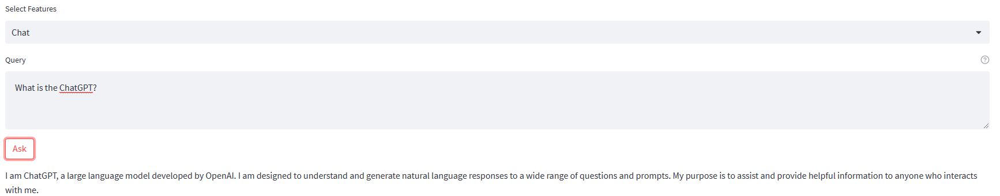
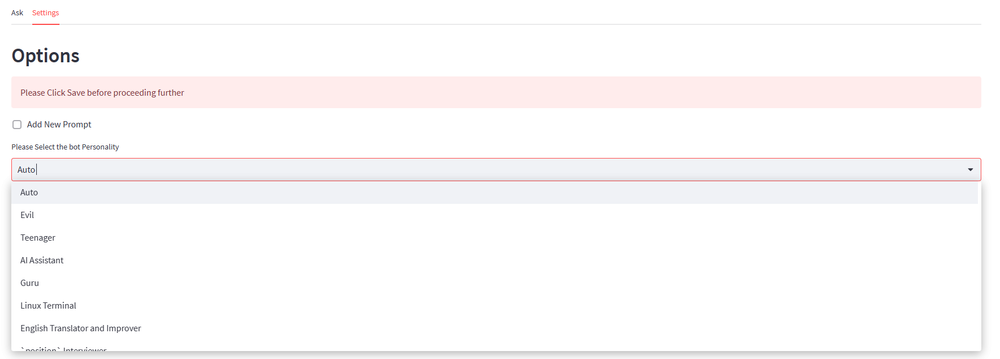
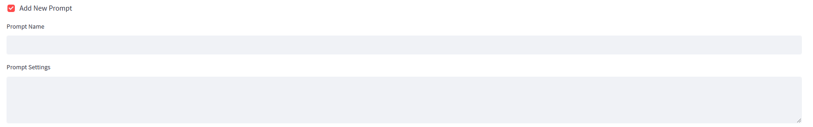

  
  <h1 align="center">ChatGPT GUI</h1>
  
ChatGPT Web Application (Alternative to lencx chatgpt desktop app)

**An Awesome Web Gui For Both Chatgpt and BingGPT , with hundreds of built in prompts and features that work out of the box without any API Keys!😄**

**[🚀 View on Streamlit🚀](https://intagpt.streamlit.app)**

---

### How does it work?

> ### Just Open the above Website and Ask!

> #### You can change the settings to select Hundred of differnet prompts in the website as follows

